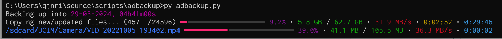

# adbackup



[**uses a modified version of adb**](https://github.com/kwyntes/adbackup-adb).

### features

- [x] incremental backups
- [x] recoverable in case device disconnects / user terminates backup
- [ ] preserve file creation times (**todo**) \
      sadly the ToyBox (like coreutils, but shit) implementation of find doesn't
      have a printf format specifier for the file's creation time and `find . -exec stat -c %y {} \;` is really slow  
      *WORKAROUND: we can write a custom binary in Rust and compile it for android,
      which can be executed without requiring root access when copied to `/data/local/tmp`* 

~~possible improvement: tar small files together if that's possible somehow so
small file transfers aren't impacted by the round-trip overhead of spawning
subprocesses.~~ solved by implementing `pull-batch`.

### usage

```
> python3 adbackup.py [flags]

-x, --exclude FILE      exclude this file from the backup. wildcards (*) can be
                        used only at the start and/or end of FILE, and are treated
                        as part of the filename if used anywhere else.
--new                   do not backup incrementally. useful when the .android_files
                        of the previous backup got fucked somehow, likely because
                        i am bad at writing software and this program is made of
                        so much spaghetti that it could feed a man for an entire
                        year.
```

### issues

- for some weird fucking reason `adb.exe` sometimes randomly decides to stop
  emitting progress information at all and i have no idea why nor what to do about
  it.  
  like it just does sometimes. and then it works again later. the source code
  doesn't make it any clearer either.
  bug report: https://issuetracker.google.com/issues/331682040
